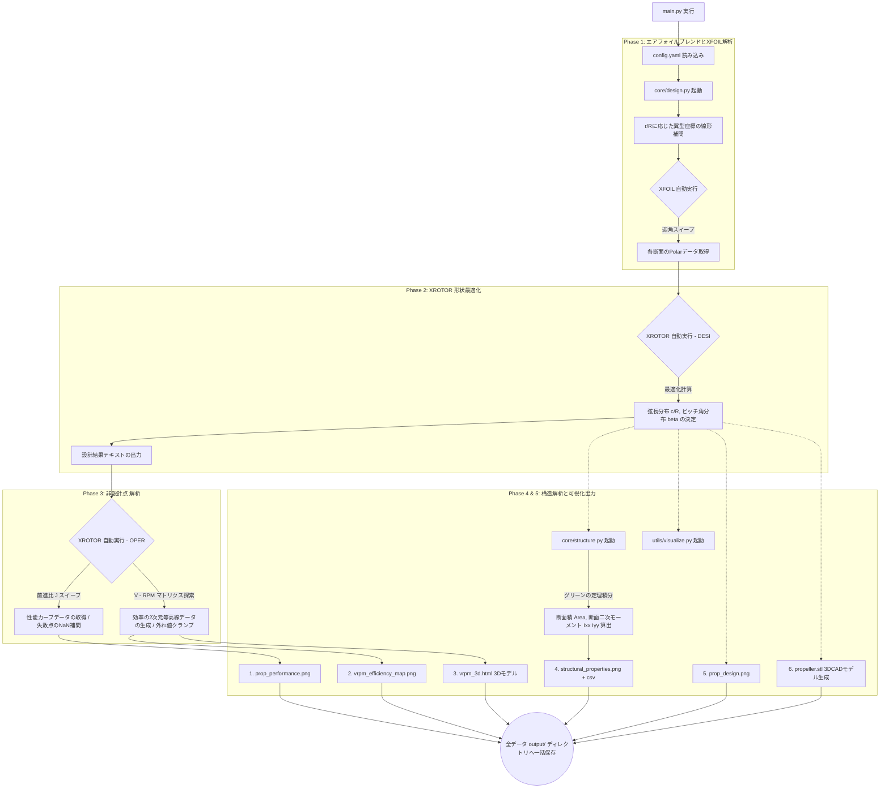

# HPA Propeller Design Tool

XFOIL と XROTOR を利用して、人力飛行機 (HPA: Human Powered Aircraft) 用プロペラの設計・空力計算・構造解析・3Dモデル出力までを一貫して全自動で行うPythonベースの強力なCUI設計ツールです。

## 🌟 プロジェクトの概要と目的
人力飛行機のプロペラ設計においては、限られたパイロットのパワー（約200W〜300W程度）をいかに無駄なく推力変換できるかが生命線となります。そのためには、プロペラ効率 $\eta$ を極限まで高めつつ、回転時の遠心力や推力・トルクに対する構造的な強度も担保しなければなりません。

本ツールは、世界的によく使われる空力解析ソフトである **XFOIL**（翼型解析ツール）と **XROTOR**（プロペラ設計・解析ツール）をPythonから自動制御し、複雑な設計パイプラインをワンボタンで実行できるように設計されました。

---

## 📚 組み込まれている理論と設計アルゴリズム

本ツールは以下の4つのフェーズ（理論）に基づいて、統合的な設計を行います。

### 1. 翼型のブレンドと粘性極力線の取得 (Phase 1)
プロペラは根元（ハブ側）から翼端（ティップ側）にかけて、求められる役割が変わります。
- **翼根付近**: 気流速度が遅いため空力的寄与は少ないが、ブレード全体の巨大な曲げモーメントを支えるため、**分厚くて構造的強度の高い翼型**（例: 円形やGEMINI翼）が必要です。
- **翼端付近**: 気流速度が速く推力の大部分を稼ぐため、**極薄で揚抗比（L/D）が極めて高い翼型**（例: DAE51）が必要です。

本プログラムは指定された翼根・翼端の `.dat` 座標データを読み込み、$r/R$（無次元半径）の比率に応じて座標点を線形補間（ブレンド）し、各位置に最適な独自翼型を生成します。その後、その位置でのレイノルズ数 $Re$ やマッハ数 $Ma$ を概算し、**XFOIL** を用いて自動で迎角（AoA）をスイープさせ、揚力係数 $C_L$ と抗力係数 $C_D$ の極力線（Polar）データを取得・蓄積します。

### 2. 最小誘導損失理論（MIL）による最適プロペラ形状の設計 (Phase 2)
XFOILで得られた各ステーションの粘性空力データを用いて、**XROTOR** の `DESI` モジュールで形状の最適化を行います。
XROTORの設計アルゴリズムは、ベッツの条件を拡張した **Larrabeeの最小誘導損失理論 (Minimum Induced Loss: MIL)** またはさらに渦法を緻密にした自由航跡モデル (Free Tip Potential Formulation) に基づいています。
特定の設計点（飛行速度 $V$、回転数 $RPM$、目標推力 $T$ または 吸収馬力 $P$）を与えた際、ウェイク（後流）へ逃げる運動エネルギー（誘導損失）が最小になるように、各断面における最適な **弦長（コード長 $c/R$）** と **ピッチ角（ねじり角 $\beta$）** の分布を逆算して導き出します。

### 3. オフデザイン（非設計点）性能解析 (Phase 3)
プロペラは常に一定の速度・回転数で飛ぶわけではありません。向かい風や離陸時など、状態が変化した際の性能（オフデザイン性能）を知る必要があります。
これを評価するために **アドバンスレシオ（前進比 $J$）** を用います。
$$ J = \frac{V}{n D} $$
（$V$: 飛行速度, $n$: 1秒あたりの回転数, $D$: プロペラ直径）

ツールはXROTORの `OPER` モジュールを呼び出し、$J$ を連続的にスイープさせて演算します。これにより推力係数 $C_T$、トルク係数 $C_Q$、効率 $\eta$ の連続的なカーブを得ることができます。
さらに本ツールは、失速領域などXROTORの演算が発散してしまったポイントを検知し、Python・Pandas側で**線形補間**を施すことで、出力グラフに穴が開かない堅牢な解析パイプラインを実現しています。
また、速度 $V$ と $RPM$ を2次元マトリクス状に振って全探索を行い、パイロットのケイデンス戦略を決定づける **V-RPM効率コンターマップ（地形図）** も出力します。

### 4. 構造特性の解析と3D化 (Phase 4, 5)
どれほど空力的に優れたプロペラでも、ペダリングで折れてしまっては意味がありません。
本プログラムはブレンドされた各2D翼型座標を読み込み、グリーンの定理（Green's Theorem）を用いて以下の断面特性を数値積分で厳密に計算します。
- **断面積 (Area)**: 重量の概算および引張応力の評価
- **断面二次モーメント ($I_{xx}, I_{yy}$)**: 面内・面外に対する曲げ剛性の評価

最後に、計算された各断面の弦長とピッチ角を空間座標として展開・回転し、3Dのポリゴンメッシュ（点群）を構成。これを構造解析ソフトやCAD、3Dプリンタにそのまま投入できる **STLファイル** として出力します。

---

## 🚀 アルゴリズム・処理フローチャート

本ツールの完全自動化された実行フローです。
※Mermaidのパースエラーを防ぐため、簡略化した識別子を使用しています。



## ⚙️ 環境構築と実行方法

1. リポジトリをダウンロード（クローン）し、直下の `config.yaml` をテキストエディタで開いて、プロペラの設計仕様（半径、ブレード数、設計速度、設計RPMなど）を入力します。使用する翼型の `.dat` ファイルは `airfoils/` ディレクトリの中に配置して指定してください。
2. 必要なPythonモジュール群（numpy, matplotlib, pandas, plotly, numpy-stl等）をインストールします。
   ```bash
   pip install -r requirements.txt
   ```
3. プログラムを起動します。引数に設定ファイルを指定してください。
   ```bash
   python main.py config.yaml
   ```
4. ログがターミナルへ流れ、XFOILやXROTORがバックグラウンドで自動的に起動と計算を繰り返します。
5. 成功すると、`output/{プロペラ名}/` のディレクトリ内部にすべての解析結果画像・CSVデータ・STL・HTMLファイルが生成されます。
