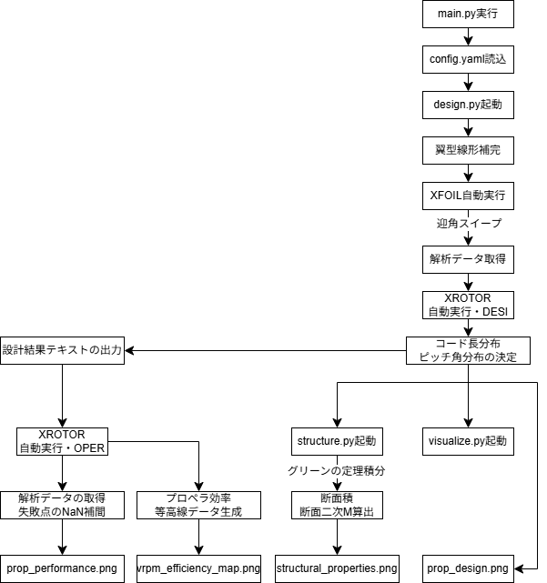

# Propeller Designer

XFOILとXROTORを利用して、プロペラの設計・空力計算・構造解析・3Dモデル出力までを一貫して全自動で行う設計ツール。

## 組み込まれている理論と設計アルゴリズム

本ツールは以下の4つのフェーズに基づいて、統合的な設計を行う。

### 1. 翼型混合と解析データの取得

#### 1-1. 翼型座標の線形補間

プロペラブレードは根元（ハブ側）から翼端にかけて、構造的要求（高い曲げ剛性）と空力的要求（高い揚抗比 $L/D$）が相反するため、単一翼型では対応できない。
そこで翼根翼型（例: GEMINI）の座標 $\mathbf{P}_\text{root}(x,y)$ と翼端翼型（例: DAE51）の座標 $\mathbf{P}_\text{tip}(x,y)$ を、ブレード無次元半径 $r/R$ を補間パラメータとして線形ブレンドする。

$$
\mathbf{P}(x, r/R) = (1 - \xi)\,\mathbf{P}_\text{root}(x) + \xi\,\mathbf{P}_\text{tip}(x), \quad \xi = \frac{r/R - (r/R)_\text{root}}{1 - (r/R)_\text{root}}
$$

両翼型の座標点数が異なる場合は、一方を弧長パラメータ $s$ で均等再サンプルしてから補間する。

#### 1-2. 局所レイノルズ数・マッハ数の推算

各半径位置での設計周速成分と飛行速度成分を合成した**相対流速** $W$ を用いて局所レイノルズ数を計算する。

$$
V_\text{rot} = 2\pi\,n\,r, \quad W = \sqrt{V^2 + V_\text{rot}^2}
$$

$$
Re = \frac{W \, c}{\nu}, \quad Ma = \frac{W}{a}
$$

（$c$: 弦長, $\nu$: 動粘性係数, $a$: 音速）

#### 1-3. XFOILによる極曲線の生成

推算した $(Re, Ma)$ を XFOIL に与え、迎角 $\alpha$ を $-5°$ から $+15°$ まで自動スイープさせ、各断面の **揚力係数 – 抗力係数 ポーラ** $(C_L, C_D)$ を取得する。
この粘性ポーラデータは後の XROTOR 設計ステップにおける翼型性能テーブルとして使用される。

### 2. 最小誘導損失理論（MIL）による最適プロペラ形状の設計

#### 2-1. 作動プロペラの基礎方程式

プロペラは推力 $T$ と吸収トルク $Q$ を持つ。これを無次元化した**推力係数** $C_T$ と**トルク係数** $C_Q$ を定義する。

$$
C_T = \frac{T}{\rho n^2 D^4}, \qquad C_Q = \frac{Q}{\rho n^2 D^5}
$$

プロペラ効率はこれらの比で定義される。

$$
\eta = \frac{C_T \cdot J}{2\pi \cdot C_Q} = \frac{T V}{Q \cdot 2\pi n}
$$

#### 2-2. ベッツの最適ウェイク条件

誘導損失が最小になるプロペラの後流は、剛体螺旋面（スクリュー面）を形成する。
これがベッツの最適条件であり、ウェイク内の誘導軸速度 $w_a$ と誘導回転速度 $w_t$ の比が全半径位置で一定値 $\lambda_w$（**ウェイクヘリックス係数**）を満たすことを要請する。

$$
\tan\phi_w = \frac{V + w_a}{\Omega r - w_t} = \text{const} \equiv \lambda_w
$$

（$\phi_w$: ウェイク螺旋の流入角）

#### 2-3. ララビーの最小誘導損失理論

Larrabee (1979) はベッツ条件を満たしつつ、各ブレード断面の弦長 $c(r)$ とピッチ角（ねじり角）$\beta(r)$ を陽に逆算する設計法をまとめた。
微小リング要素に働く推力 $dT$ とトルク $dQ$ を、翼素モーメント理論（BEM: Blade Element Momentum）と渦理論の両方から導き、それらを等置することで設計変数を決定する。

**翼素理論による微分推力・微分トルク**（揚力・抗力係数を用いた表現）:

$$
dT = B \cdot \frac{1}{2}\rho W^2 c \left(C_L \cos\phi - C_D \sin\phi\right) dr
$$

$$
dQ = B \cdot \frac{1}{2}\rho W^2 c \left(C_L \sin\phi + C_D \cos\phi\right) r\, dr
$$

（$B$: ブレード枚数, $\phi$: 局所流入角）

**軸運動量・角運動量理論による微分推力・微分トルク**:

$$
dT = 4\pi r \rho V^2 a(1+a) F\, dr, \qquad dQ = 4\pi r^3 \rho V \Omega a'(1-a) F\, dr
$$

（$a$: 軸誘導係数, $a'$: 回転誘導係数, $F$: プラントルの翼端損失補正係数）

**プラントルの翼端損失補正**:

$$
F = \frac{2}{\pi} \arccos\!\left(\exp\!\left(-\frac{B(R-r)}{2r\sin\phi}\right)\right)
$$

最適弦長 $c$ は、設計揚力係数 $C_{L,\text{des}}$ と局所流入角 $\phi$ から:

$$
\frac{Bc}{2\pi r} = \frac{4 F \sin^2\phi}{\sigma C_L}
$$

（$\sigma = C_L / (C_L \cos\phi - C_D \sin\phi)$: 有効揚阻比）

最適ピッチ角は:

$$
\beta = \phi + \alpha_\text{des}
$$

（$\alpha_\text{des}$: 最大揚阻比を与える迎角）

XROTORの `DESI` コマンドはこのアルゴリズムを内部で反復収束させ、最終的な $c(r)$ と $\beta(r)$ の分布を出力する。

### 3. オフデザイン性能解析

#### 3-1. 前進比（アドバンスレシオ）によるパラメータ化

プロペラの作動状態は**前進比 $J$** という1つの無次元量で特徴付けられる。

$$
J = \frac{V}{n D} = \frac{V}{2\pi\,\Omega\,R}
$$

$J$ が小さい → 機速に対して回転が速い（離陸・上昇モード）  
$J$ が大きい → 機速に対して回転が遅い（高速巡航・過剰速度モード）

#### 3-2. 推力・トルク係数の特性曲線

XROTORの `OPER` モジュールにより $J$ をスイープすると、$(C_T, C_Q, \eta)$ の特性曲線が得られる。
設計点 $J_\text{des}$ 付近で $\eta$ は最大値をとる山形分布を示し、$J$ が大きくなり推力係数 $C_T$ がゼロに近づく点（**ゼロ推力前進比** $J_0$）の付近では計算が数値発散しやすい。

本ツールでは発散した点を NaN として検出し、pandas の線形補間（`interpolate`）でギャップを埋めることで、連続した滑らかな特性曲線を保証する。
さらに効率 $\eta$ を物理的上限の $[0.0, 1.0]$ にクランプすることで、発散点由来の外れ値スパイクを除去している。

#### 3-3. V-RPM 効率マトリクス

飛行速度 $V \in [V_\text{des} - \Delta V,\; V_\text{des} + \Delta V]$ と回転数 $RPM \in [RPM_\text{des} - \Delta n,\; RPM_\text{des} + \Delta n]$ を $N\times N$ の格子点で全探索し、各格子点で XROTOR に `VELO` コマンドで直接 $(V, n)$ を入力して効率を取得する。
これを Matplotlib の `contourf` で等高線表示することで、パイロットが最高効率を得るための最適な **ケイデンス（RPM）— 速度（V）** の組み合わせを一目で把握できる**戦略マップ**となる。

### 4. 構造特性（断面積・断面二次モーメント）の解析

#### 4-1. グリーンの定理による断面積の計算

ブレンドされた翼型の座標列 $(x_i,\, y_i)$（$i = 0,1,\ldots,N-1$）を閉じた多角形とみなし、グリーンの定理を適用することで断面積 $A$ を数値積分なしに厳密解として算出できる。

$$
A = \frac{1}{2} \left|\sum_{i=0}^{N-1} (x_i y_{i+1} - x_{i+1} y_i)\right|
$$

（末尾 $N$ は先頭 $0$ に戻るものとする。これはシューレース公式（Shoelace formula）とも呼ばれる。）

#### 4-2. 断面一次モーメントと重心（セントロイド）

$$
\bar{x} = \frac{1}{6A}\sum_{i} (x_i + x_{i+1})(x_i y_{i+1} - x_{i+1} y_i)
$$

$$
\bar{y} = \frac{1}{6A}\sum_{i} (y_i + y_{i+1})(x_i y_{i+1} - x_{i+1} y_i)
$$

#### 4-3. 断面二次モーメント（慣性モーメント）

重心まわりの断面二次モーメントは、グリーンの定理を2次形式に拡張して算出できる。

$$
I_{xx}^{(0)} = \frac{1}{12}\sum_{i} (y_i^2 + y_i y_{i+1} + y_{i+1}^2)(x_i y_{i+1} - x_{i+1} y_i)
$$

$$
I_{yy}^{(0)} = \frac{1}{12}\sum_{i} (x_i^2 + x_i x_{i+1} + x_{i+1}^2)(x_i y_{i+1} - x_{i+1} y_i)
$$

平行軸の定理（Parallel Axis Theorem）で重心へ移動する。

$$
I_{xx} = I_{xx}^{(0)} - A\,\bar{y}^2, \qquad I_{yy} = I_{yy}^{(0)} - A\,\bar{x}^2
$$

$I_{xx}$ はブレード面外方向（推力方向）の曲げ剛性に、$I_{yy}$ は面内方向（進行方向）の曲げ剛性に対応する。

## 実行フローチャート

本ツールの完全自動化された実行フローチャートを以下に示す。



## 環境構築と実行方法

1. リポジトリをダウンロード（クローン）し、直下の `config.yaml` をテキストエディタで開いて、プロペラの設計仕様（半径、ブレード数、設計速度、設計RPMなど）を入力。使用する翼型の `.dat` ファイルは `airfoils/` ディレクトリの中に配置して指定する。
2. 必要なPythonモジュール群（numpy, matplotlib, pandas, plotly, numpy-stl等）をインストールする。
   ```bash
   pip install -r requirements.txt
   ```
3. プログラムを起動する。引数に設定ファイルを指定する。
   ```bash
   python main.py config.yaml
   ```
4. ログがターミナルへ流れ、XFOILやXROTORがバックグラウンドで自動的に起動と計算を繰り返す。
5. 成功すると、`output/{プロペラ名}/` のディレクトリ内部にすべての解析結果画像・CSVデータが生成される。

## ファイル構成

```
./
├── main.py                  # メインエントリポイント
├── config.yaml              # 設計仕様の入力ファイル
├── requirements.txt
├── airfoils/                # 翼型 .dat ファイル格納ディレクトリ
│   ├── GEMINI.dat
│   └── DAE51.dat
├── core/
│   ├── design.py            # Phase 1 & 2: 翼型ブレンド・XROTOR設計
│   ├── analysis.py          # Phase 3: オフデザイン解析・V-RPMスイープ
│   ├── structure.py         # Phase 4: 断面構造特性の計算
│   ├── airfoil_utils.py     # 翼型ブレンドのユーティリティ
│   └── xfoil_runner.py      # XFOILサブプロセス制御
└── utils/
    ├── config.py            # 設定ファイル読み込み
    └── visualize.py         # 全グラフ描画・3Dモデル出力
```
